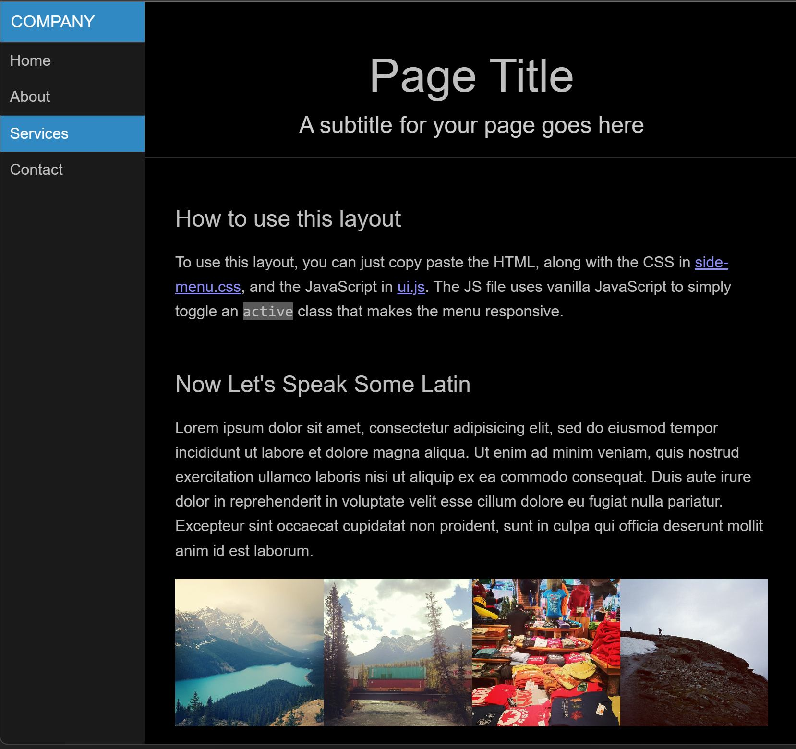

    <h1 align="center">Pseudo PHP Encoder</h1>

Inspired with the idea behind [IonCube / PHP Encoder 12](https://www.ioncube.com/php_encoder.php?page=pricing) and seeing how [Adminer](https://www.adminer.org/en/)'s main file is (partially) encoded, I have came up with the idea of doing the same using [Yii 2 Micro Framework](https://www.yiiframework.com/doc/guide/2.0/en/tutorial-yii-as-micro-framework) and [LZ-based compression algorithm for JavaScript](https://github.com/pieroxy/lz-string/).

## REQUIREMENTS

Any of these components are required (if you don't have them already installed):

1. Web server, any kind of LAMP-like package like [XAMPP](https://www.apachefriends.org/index.html). Or manually installed PHP interpreter
2. [Composer](http://getcomposer.org/)
3. [Git for Windows](https://gitforwindows.org/)
4. A web browser in a kind of new version?

This was tested under **Windows 11 Pro** and **PHP 8.2.x** only.

## INSTALLATION

### Install XAMPP

If you do not have [XAMPP](https://www.apachefriends.org/index.html) or any other LAMP-like package, you can download and install it from [ApacheFriends.org](https://www.apachefriends.org/download.html) website.

If you pick branch 8.1 or 8.0, you'll have to use the `--ignore-platform-req=php` flag with Composer, as described below and [in here](https://forum.yiiframework.com/t/current-version-of-yii-2-not-ready-for-php-8-2/135156/2?u=trejder).

### Install Git for Windows

If you do not have [Git for Windows](https://gitforwindows.org/) or any other version of git already installer, you can download and install it from [their homepage](https://gitforwindows.org/).

### Install Composer

If you do not have [Composer](http://getcomposer.org/), you may install it by following the instructions
at [getcomposer.org](http://getcomposer.org/doc/00-intro.md#installation-nix) website.

### Get this project via Composer

You can then install this project template using the following command:

~~~
git clone git@github.com:telecare-poland/test-algorytmu-lzf.git
composer update --ignore-platform-req=php
~~~

The `--ignore-platform-req=php` flag must only be used, if you are [using PHP 8.2 or newer](https://forum.yiiframework.com/t/current-version-of-yii-2-not-ready-for-php-8-2/135156/2?u=trejder).

## RUNNING

Start your favorite local web server or the server bundled with PHP

~~~
cd htdocs/test-algorytmu-lzf
php yii serve
~~~

Then open up your web browser and navigate it to `http://localhost:8080` address.

CONFIGURATION
-------------

1. Visit some [Base64 Converter](https://base64.guru/converter) for example `https://base64.guru/converter`.
2. Paste any kind of HTML code into it and convert it to Base64.
3. Edit the `views/site/index.php` file and replace **entire content of it** with the generated string.

For example, turn this:

    <h2>Base64 Converter</h2>
    <h3>The Base64 online converter supports both functions of the algorithm on same page. If you need to encode a text to Base64, fill in the Text field and press Encode text to Base64 -- the result will appear in the Base64 field. Otherwise, if you have a Base64 string, paste it into the Base64 field and press Decode Base64 to text -- the result will appear in the Text field.<h3>
    <h2>About Base64 online converter</h2>
    <h3>Please note that this Base64 converter supports only main standard and decodes the data in strict mode. Perhaps this option does not suit your needs, and you want to encode text or decode Base64 using other variations of this algorithm. If so, please check the following online convertors. They are also simple and free, but they are sharpened for certain tasks.<h3>

Into this:

    PGgxPkJhc2U2NCBDb252ZXJ0ZXI8L2gyPg0KPGgzPlRoZSBCYXNlNjQgb25saW5lIGNvbnZlcnRlciBzdXBwb3J0cyBib3RoIGZ1bmN0aW9ucyBvZiB0aGUgYWxnb3JpdGhtIG9uIHNhbWUgcGFnZS4gSWYgeW91IG5lZWQgdG8gZW5jb2RlIGEgdGV4dCB0byBCYXNlNjQsIGZpbGwgaW4gdGhlIFRleHQgZmllbGQgYW5kIHByZXNzIEVuY29kZSB0ZXh0IHRvIEJhc2U2NCAtLSB0aGUgcmVzdWx0IHdpbGwgYXBwZWFyIGluIHRoZSBCYXNlNjQgZmllbGQuIE90aGVyd2lzZSwgaWYgeW91IGhhdmUgYSBCYXNlNjQgc3RyaW5nLCBwYXN0ZSBpdCBpbnRvIHRoZSBCYXNlNjQgZmllbGQgYW5kIHByZXNzIERlY29kZSBCYXNlNjQgdG8gdGV4dCAtLSB0aGUgcmVzdWx0IHdpbGwgYXBwZWFyIGluIHRoZSBUZXh0IGZpZWxkLjxoMz4NCjxoMj5BYm91dCBCYXNlNjQgb25saW5lIGNvbnZlcnRlcjwvaDI+DQo8aDM+UGxlYXNlIG5vdGUgdGhhdCB0aGlzIEJhc2U2NCBjb252ZXJ0ZXIgc3VwcG9ydHMgb25seSBtYWluIHN0YW5kYXJkIGFuZCBkZWNvZGVzIHRoZSBkYXRhIGluIHN0cmljdCBtb2RlLiBQZXJoYXBzIHRoaXMgb3B0aW9uIGRvZXMgbm90IHN1aXQgeW91ciBuZWVkcywgYW5kIHlvdSB3YW50IHRvIGVuY29kZSB0ZXh0IG9yIGRlY29kZSBCYXNlNjQgdXNpbmcgb3RoZXIgdmFyaWF0aW9ucyBvZiB0aGlzIGFsZ29yaXRobS4gSWYgc28sIHBsZWFzZSBjaGVjayB0aGUgZm9sbG93aW5nIG9ubGluZSBjb252ZXJ0b3JzLiBUaGV5IGFyZSBhbHNvIHNpbXBsZSBhbmQgZnJlZSwgYnV0IHRoZXkgYXJlIHNoYXJwZW5lZCBmb3IgY2VydGFpbiB0YXNrcy48aDM+

(one line only, please)

Now, go back to your borwser and refresh the `http://localhost:8080` URL to see the effects.

## EXAMPLE

If everything runs as expected, you should see a webpage close to the below one:

This is a fully-featured website (that uses HTML, CSS and JS) even though, if you press <kbd>Ctrl</kbd>+<kbd>U</kbd>, you'll see something similiar to this:

as a source.

## DISCLAIMER

The example HTML code used in here is based on [Pure](https://purecss.io/).

We have used the [`pure/site/static/layouts/side-menu/`](https://github.com/pure-css/pure/tree/master/site/static/layouts/side-menu) example and changed it the way that it includes each and every required external file embed directly into [`index.html`](https://github.com/telecare-poland/test-algorytmu-lzf/blob/main/source/side-menu-oneliner/index.html). Then the contents of this file were base64-encoded (using [Base64 Converter](https://base64.guru/converter)) and replaced content of the [`views\site\index.php`](https://github.com/telecare-poland/test-algorytmu-lzf/blob/main/views/site/index.php) file.

The source (both original and changed into one-liner) is put into [`source`](https://github.com/telecare-poland/test-algorytmu-lzf/tree/main/source) folder.